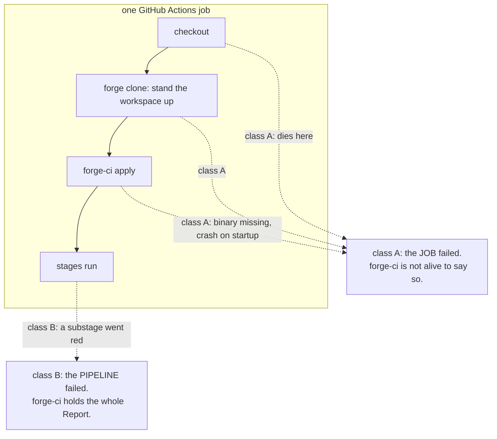
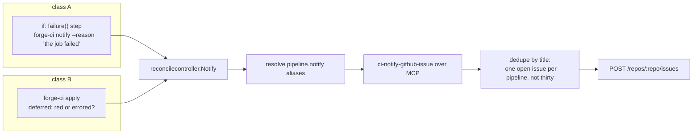

# The notify port

A design, not a change. Nothing here is built.

## What exists today

Nothing declares it. `templates.go` decides on its own:

```go
func reportsFailure(w WorkflowSpec) bool {
	return w.Cron != "" || len(w.Events) > 0
}
```

That renders an `if: failure()` step at the end of the job which shells out
to `gh issue list` and `gh issue create`. Three consequences:

- It is not a spec key, so `cmd/ci-compute-github/spec.yaml` does not
  mention it and `hack/docs-check.sh` has nothing to check. An operator
  cannot turn it on, turn it off, or say where it goes.
- The dedupe-by-title decision lives in generated YAML, where no test
  reaches it.
- It calls `gh`, which the toolchain image does not carry. The step fires
  only when a run has already failed, so the reporter breaks exactly when
  it is needed.

## The two failure classes

This is what shapes the design.



An engine is called by forge-ci in process. It cannot report the death of
the process hosting it. So class A is reachable only from a workflow step
with `if: failure()`, and no port removes that step.

What a port buys is that the step stops carrying logic. It calls one verb,
and both classes arrive at the same engine through the same config.

## Shape

`notify` becomes the seventh port, declared like `triggers:`.

```yaml
engines:
  - alias: issues
    type: notify
    engine: "forge://github.com/alexandremahdhaoui/forge-ci/cmd/ci-notify-github-issue"
    manager: github
    spec:
      repo: alexandremahdhaoui/golden-factory
      tokenEnv: FORGE_CI_GITHUB_TOKEN
      labels: [ci]

notify: [issues]
```

`config.Pipeline` gains `Notify []string`, validated by the same
`requirePort` every other list uses. Empty means silence, which is what a
pipeline that nobody schedules wants.

### The wire type

```go
type NotifyInput struct {
	Revision string
	// Reason is why this fired, in one line: "the job failed before the
	// pipeline started" or "stage build did not advance".
	Reason string
	// Stages is what was red. Empty for a class A failure, which is the
	// signal that forge-ci never got to run.
	Stages []StageReport
	// RunURL is the CI run, when the caller knows one.
	RunURL string
	Spec   map[string]any
}

type NotifyOutput struct {
	Delivered bool
	// Where the notification landed, for the report: an issue URL.
	Where  string
	Reason string
}
```

### Two entry points, one port



The `if: failure()` step's whole body becomes one line. It carries no
dedupe, no title, no API call, and needs no `gh`. It works in the toolchain
image because `forge-ci` is on PATH there.

A red pipeline fires both entry points: `apply` notifies, then exits
non-zero, then the step fires. Dedupe by title makes the second a no-op,
and dedupe is now Go with a test rather than a shell `if`.

### Why apply notifies at all, when the step catches everything

Because the step is GitHub's. A pipeline on `ci-compute-local`, or on
whatever compute engine comes next, has no `if: failure()` step and no
runner. Notification belongs to the pipeline, and the step is one host's
belt on top of it.

## What replaces the inference

`reportsFailure`'s reasoning is good and its placement is not. The reasoning
- a scheduled or dispatched run has no audience, a push or a manual run has
one - becomes documentation for an operator choosing the key, not a rule
they cannot see:

```yaml
workflows:
  - name: pipeline
    kind: command
    events: [member-pushed]
    reportFailure: true      # renders the step and issues: write
```

Declared, in `spec.yaml`, gated by `docs-check`. Two pipelines gain one key.

## Failing to notify is not a failed run

The same rule the test runner has. A notification that cannot be delivered
is reported in the run output and never turns a green run red, and never
masks the failure it was trying to announce. A notify engine that errors
gets one line in the report.

## Cost

| Where | What |
|---|---|
| forge-ci-spec | `PortNotify`, `notify:` on the pipeline, vectors for both |
| forge-ci `pkg/config` | `Notify []string` + `requirePort` |
| forge-ci `pkg/citypes` | `NotifyInput` / `NotifyOutput` in the OpenAPI spec, so generated schemas accept them |
| forge-ci controller | `Notify` on reconcilecontroller, deferred call in `Apply` |
| forge-ci driver | `forge-ci notify` verb |
| new engine | `cmd/ci-notify-github-issue`: forge-dev.yaml, spec.yaml, handlers.go |
| githubadapter | issue list + create, with the token the spec names |
| workflowcontroller | `reportFailure` key, one-line step body, golden files |
| e2e | a case, or the engine is decoration per CLAUDE.md |

## Open, for you

1. **Seventh port, or a notify list on the state/manager layer?** A port is
   the honest shape and it is a schema change in forge-ci-spec.
2. **Does `apply` notify, or only the step?** Only-the-step is smaller and
   works today; apply-notifies is the one that survives a non-GitHub
   compute engine.
3. **Is an issue the right artifact?** It is what exists. The port makes a
   second engine cheap later.
